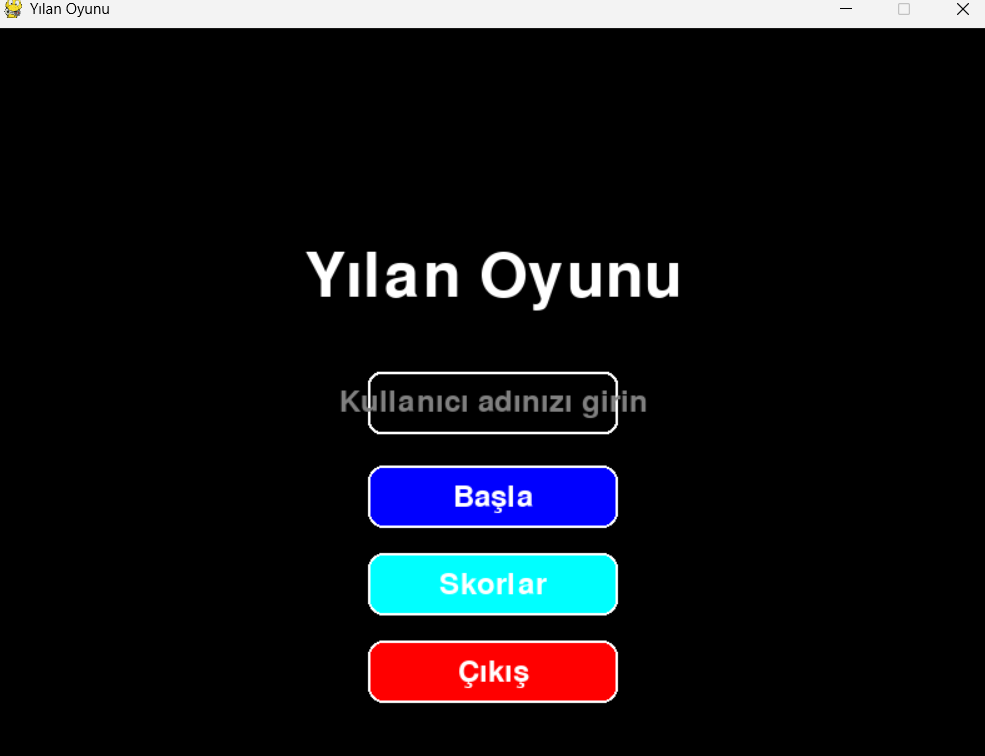
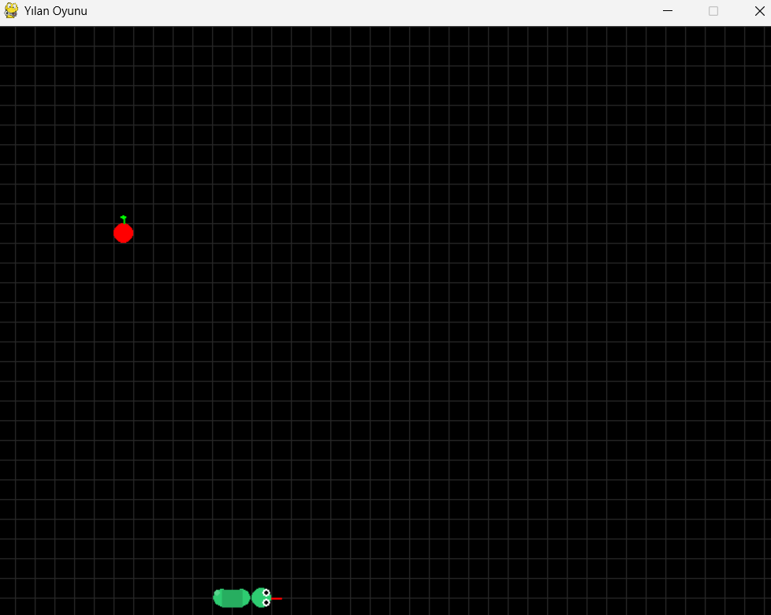
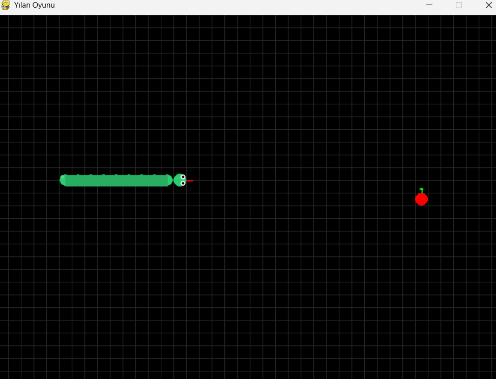
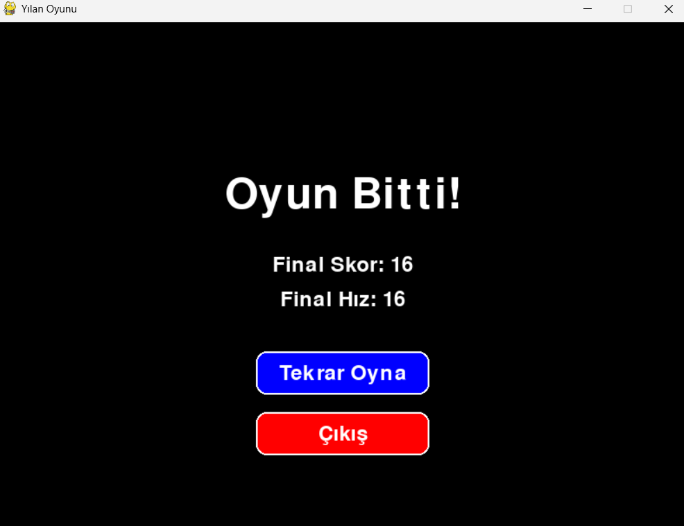
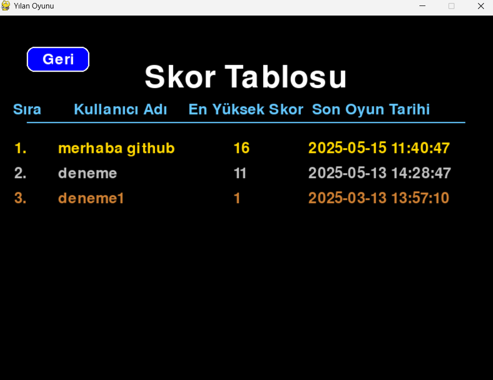

<h1>Snake Game</h1>

Klasik yılan oyununun Python ve Pygame ile yapılmış versiyonu.

 

## Nasıl Oynanır

- Yön tuşlarını kullanarak yılanı kontrol edin
- Kırmızı yemleri yiyerek puan kazanın
- Duvarlara veya yılanın kendi vücuduna çarpmamaya dikkat edin
- Her yem yediğinizde yılan büyür ve skorunuz artar 

## Uygulama Görselleri
|             Giriş Ekranı             |              Oyun İçi Görüntü             |            Büyüme Fonksiyonu             |
| :----------------------------------: | :---------------------------------------: |:---------------------------------------: |
|             |                 |              |

|             Oyun Bitti               |                Skor Tablosu               |
| :----------------------------------: | :---------------------------------------: |
|           |                   | 
